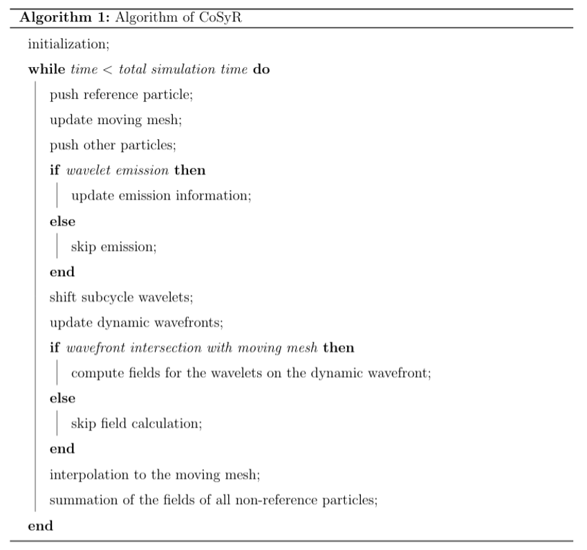

###### Summary
Cosyr is a particle beam dynamics simulation code with multi-dimensional [synchrotron radiation](https://en.wikipedia.org/wiki/Synchrotron_radiation) effects. It tackles a fundamental problem of the self-consistent nonlinear dynamics of a particle beam from its complete self-fields, particularly the radiation fields, i.e the [coherent synchrotron radiation (CSR)](http://linkinghub.elsevier.com/retrieve/pii/S016890029700822X) problem. The latter underpins many accelerator design issues in ultra-bright beam applications, as well as those arising in the development of advanced accelerators. It is written in C++ and supports two levels of parallelism with MPI and Kokkos. CoSyR is an open-source code (https://github.com/lanl/cosyr) which is in active development. A [poster](./docs/CSR_IPAC2021.pdf) about Cosyr is presented at the [IPAC 2021](https://www.ipac21.org/index.php#) conference.

###### Algorithms

Cosyr's algorithm is based on the Lienard-Wiechert field formula of the retarded Green’s function for the Maxwell equations. The algorithm is shown in the diagram below.

A local Cartesian moving window is used to follow the beam’s trajectory and the fields (or potential) for each particle are calculated on the radiation wavefronts that intersect with moving window. These radiation wavefronts are emitted along the trajectory of the particle at a specified interval. The wavefronts and the points on the wavefronts (called wavelets) where fields are calculated form a mesh that naturally adapts to the emission. Specifically, wavefronts and wavelets are divided into two groups, i.e., dynamic or subcycle ones, depending on the retarded time. For wavefronts/wavelets corresponding to a large retarded time, e.g., longer than the typical time scale of the beam evolution, the fields are calculated taking into account of the full dependence on the position, velocity and acceleration at emission. For the ones that are emitted with a retarded time shorter than the beam evolution time scale, they are treated as emission from subcycle time steps where the emitting particles are assumed to follow the reference trajectory but shifted by the particle’s offset to the reference particle (the reference particle is a particle that has the reference energy and only experiences external fields). Accordingly, the subcyle wavelets and their fields are precalculated using the reference particle.   All wavelet fields are then interpolated onto a uniform mesh in the moving window using a flexible particle/mesh remapping tool, Portage, and contributions from all particles are summed together to obtain the beam self-fields. The beam fields are again interpolated to the particle’s location and used to push them in the same manner as in conventional Particle-In-Cell codes. This method allows: (1) the separation of the high frequency radiations from the ones that can be resolved by the moving mesh by selecting the wavelets on a wavefront; (2) synchrotron radiation emission from the beam particles’ trajectories which dynamically respond to the self-fields; (3) multiple inherent parallelisms to be implemented on modern high performance computing architectures with MPI, multi-threading and GPUs. However, this approach is also much more computationally intensive than other CSR models and codes and hence currently limited to the modeling of low energy beams

The Cosyr code consists of the following three components:

- a field/wavelet computation kernel,
- a wavelet-to-mesh interpolation module,
- a particle pusher. 

The particle pusher is similar to those for existing high performance kinetic plasma simulation codes, such as [VPIC](https://github.com/lanl/vpic). Unlike other particle-mesh codes with a local PDE-based field solver that communicates only with neighbors, Cosyr's field solver is based on the retarded Green's function and thus nonlocal both in time and space. Such an approach allows both the decoupling of the time/spatial scales in coherent and incoherent effects, and the improved solution to the beam self-fields. 

###### Performance

Cosyr is designed to leverage multi-GPU nodes. It exploits the fact that the field kernel, wavelets emission and particle update are completely local. For a given beam, a subset of particles is assigned to a MPI rank. The field kernel is primarily parallelized over particles to be run on manycore nodes or GPU. The wavelet-to-mesh interpolation is done in a multithreaded way using [Portage](https://github.com/laristra/portage).

### Build and use

It can be built on Linux or macOS using [CMake](https://cmake.org).  
It requires a [C++14](https://isocpp.org/wiki/faq/cpp14-language) compiler endowed with [OpenMP](https://www.openmp.org).  
The field kernels are designed to be run on manycore CPU or GPU.  
For optimized builds on Intel KNL, we recommend the Intel compiler.  
To run on Nvidia's GPU, it should be compiled with [nvcc](https://docs.nvidia.com/cuda/cuda-compiler-driver-nvcc/index.html).  
> It was not currently tested on AMD's GPU.  

###### Dependencies

- [kokkos](https://github.com/kokkos/kokkos) for the wavefronts and field kernels.
- [cabana](https://github.com/ECP-copa/Cabana) for the particle pusher.
- [portage](https://github.com/laristra/portage) for the interpolation step.
- [pybind](https://github.com/pybind/pybind11) and a [python](https://www.python.org) environment to handle simulation parameters.  

The instructions to build the project and its dependencies can be found [here](./docs/BUILD.md).   

###### Running

The simulation parameters are given through an input deck.  
The latter is simply a regular Python script.  
Those parameters are loaded into the Python locals and can changed as needed.  
A set of examples are given in the [input](./input) directory.  
It is also possible to initialize a beam array for the simulation as shown [here](./input/test_beam_remap.py).  
To run: `mpirun -np 4 ./cosyr params.py`

### License and contributions

Cosyr is developed at Los Alamos National Laboratory (C20129).  
It is supported by the Laboratory Directed Research and Development program (LDRD).  
It is open source under the [BSD-3 licence](./LICENSE.txt).  
It is developed by:

- Chengkun Huang 
- Feiyu Li 
- Hoby Rakotoarivelo
- Boqian Shen 

Other contributors:

- Rao Garimella 
- Thomas Kwan
- Bruce Carlsten 
- Robert Robey 
- Orion Yeung
- Parker Pombrio

### Copyright
© 2021. Triad National Security, LLC. All rights reserved.
This program was produced under U.S. Government contract 89233218CNA000001 for Los Alamos
National Laboratory (LANL), which is operated by Triad National Security, LLC for the U.S.
Department of Energy/National Nuclear Security Administration. All rights in the program are
reserved by Triad National Security, LLC, and the U.S. Department of Energy/National Nuclear
Security Administration. The Government is granted for itself and others acting on its behalf a
nonexclusive, paid-up, irrevocable worldwide license in this material to reproduce, prepare
derivative works, distribute copies to the public, perform publicly and display publicly, and to permit others to do so.
